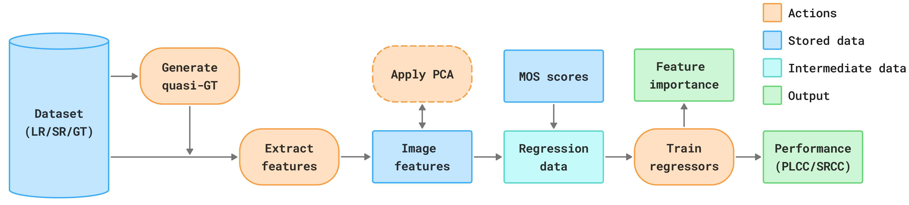
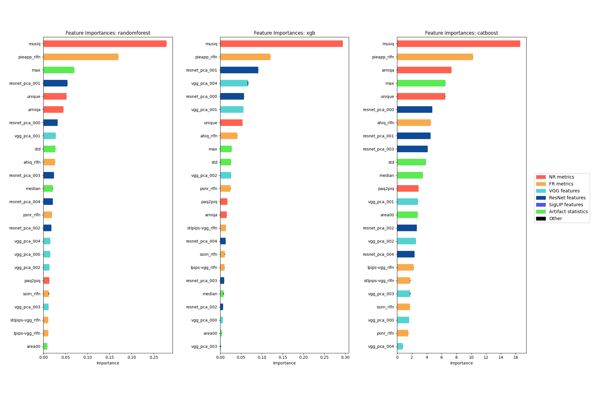
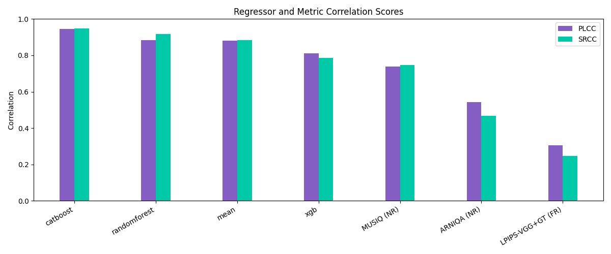

# QualiSR-Lab: Reduced-Reference IQA for SR

[Oleg Ryabinin](https://orcid.org/0009-0008-3153-4183)<sup>1,2</sup> | [Evgeney Bogatyrev](https://orcid.org/0000-0002-6173-3561)<sup>1,2,3</sup> | [Dmitriy Vatolin](https://orcid.org/0000-0002-8893-9340)<sup>1,2,3</sup>

<sup>1</sup>Lomonosov Moscow State University, 119991, Moscow, Russia

<sup>2</sup>AI Center, Lomonosov Moscow State University

<sup>3</sup>MSU Institute for Artificial Intelligence, Lomonosov Moscow State University

## 🔎 Overview

This project studies which features extracted from Low-Resolution (LR) and Super-Resolution (SR) images are most informative for Image Quality Assessment (IQA). Its purpose is to assist researchers in studying the best features for their upscaled image quality metrics by providing a pipeline to extract the features and build a comprehensive graphical summary on their contribution to IQA and correlation of the resulting metric with human scores.

The proposed pipeline is:

1. **Prepare labels and features**  
   Compute image features and attach normalized quality labels.

2. **Train regressors**  
   Fit regression models on the resulting tabular data to obtain a simple Reduced-Reference (RR) quality metric.

3. **Analyze feature importance and correlation**  
   Evaluate feature importance and compute PLCC/SRCC to identify the most informative features for SR quality assessment.

The sections below describe the required data format and the workflow.



---

## 🐌 Quickstart With Precomputed Features

The fastest smoke test uses the precomputed CSV files already tracked in this
repository.

```bash
python -m pip install -e ".[regressors]"
qualisr-run-regressors --config configs/default.json
```

Or build Docker image:

```bash
docker build -t qualisr-lab .
docker run --rm qualisr-lab
```

You can run any of the following commands inside the Docker container:

```bash
docker run --rm -it --mount type=bind,source="${PWD}",target=/workspace qualisr-lab bash
qualisr --help
qualisr-run-regressors --config configs/default.json

```

The image installs the package under `/app`. The optional bind mount above makes
your local checkout available at `/workspace` without replacing the installed
package inside the image.

---

## 🛠️ Installation Options


For the regression pipeline only:

```bash
python -m pip install -e ".[regressors]"
```

For full feature extraction on CPU:

```bash
python -m pip install -e ".[features,regressors]"
```

For development:

```bash
python -m pip install -e ".[dev,regressors]"
pytest
```

The legacy fully pinned environment is kept in `requirements.txt`.

See [dataset/readme.md](dataset/readme.md) for dataset download notes.

---

## 🚀 Workflow

### Step 0 (optional): Prepare reference images

Produce [RLFN](https://github.com/bytedance/RLFN) / [SPAN](https://github.com/zononhzy/SPAN) / bicubic images for LR + SR pairs (used to compute FR metrics).

```bash
qualisr-make-reference \
  --lr-dir dataset/lr \
  --sr-dirs PASD=dataset/sr/PASD SUPIR=dataset/sr/SUPIR RealESRGAN=dataset/sr/RealESRGAN \
  --out-root dataset/ref \
  --refs bicubic rlfn span \
  --scale 4 \
  --rlfn-script realtime_sr/RLFN/inference-RLFN.py \
  --rlfn-ckpt realtime_sr/RLFN/rlfn-tuned-4x.pth \
  --span-script realtime_sr/SPAN/inference-SPAN.py \
  --span-ckpt realtime_sr/SPAN/span-tuned-4x.pth
```


### Step 1: Compute image features

Compute FR / NR / [VGG](https://arxiv.org/abs/1409.1556) / [ResNet](https://arxiv.org/abs/1512.03385) / [SigLIP](https://arxiv.org/abs/2303.15343) features for SR images and save them into a single CSV file.

SR methods are passed as `METHOD=DIR`.  
Reference image filenames are expected in the format:

```text
<sr_stem>@<sr_method>@<ref_name>.<ext>
```

```bash
qualisr-extract-features \
  --sr-dirs PASD=dataset/sr/PASD SUPIR=dataset/sr/SUPIR RealESRGAN=dataset/sr/RealESRGAN \
  --gt-dir dataset/hr \
  --lr-dir dataset/lr \
  --ref-dirs bicubic=dataset/ref/bicubic rlfn=dataset/ref/rlfn span=dataset/ref/span \
  --features fr,nr,vgg,resnet,siglip \
  --output features/image_features.csv \
  --device cuda
```

---

### Step 2: Apply PCA to high-dimensional features

Apply Principal Component Analysis (PCA) to high-dimensional feature blocks such as `vgg_*` and `resnet_*` in CSV files produced in Step 1.

```bash
qualisr-apply-pca \
  --input features/image_features.csv \
  --blocks vgg=vgg_ resnet=resnet_ \
  --n-components 5 10 25 50 75 \
  --test-size 0.2 \
  --split-seed 42 \
  --output-dir features/pca
```

---

### Step 3: Compute artifact-mask statistics

Compute summary statistics for heatmaps stored as `.npy`, `.npy.gz`, or compatible compressed files.  
Input directories can be passed as `PREFIX=DIR` to ensure stable sample naming.

```bash
qualisr-compute-stats \
  --heatmap-dirs PASD=dataset/heatmaps/PASD SUPIR=dataset/heatmaps/SUPIR RealESRGAN=dataset/heatmaps/RealESRGAN \
  --output features/stats@grounding.csv \
  --percentiles 5 95 \
  --area-thresholds 0 0.5 0.75
```

---

### Step 4: Fit regressors and analyze results

Train regressors and produce summary on feature importances and correlations. The correlation plot can also include direct NR/FR metric baselines from feature CSV files.

```bash
qualisr-run-regressors --config configs/default.json
```

You can also use `regressors.ipynb` notebook for experiments. It trains regressors, evaluates them, and visualizes:

- feature importances,
- PLCC/SRCC correlations,
- comparisons across feature groups and model settings.

The first notebook cell describes the workflow for running experiments individually or in batches.

Example outputs:




---

## 🔬 Feature Types

This section summarizes the feature groups used in the pipeline. For references and guidelines to adding custom features, address [features/readme.md](features/readme.md).

### No-Reference (NR) metrics

NR metrics are widely used in SR-IQA because they do not require a perfect high-resolution reference image. Their main limitation is that they ignore information available in the input LR image, which may cause them to miss or even reward artifacts introduced by SR models.

Recommended NR metrics in this project, based on results from the [SR Metrics Benchmark](https://videoprocessing.ai/benchmarks/super-resolution-metrics.html):

- [Q-Align](https://github.com/Q-Future/Q-Align)
- [MUSIQ](https://github.com/anse3832/MUSIQ)
- [ARNIQA](https://github.com/miccunifi/ARNIQA)
- [UNIQUE](https://github.com/zwx8981/UNIQUE)
- [PaQ2PiQ](https://github.com/baidut/paq2piq)

These metrics are computed through the [PyIQA](https://github.com/chaofengc/IQA-PyTorch) interface, so the list can be changed easily.

---

### Full-Reference (FR) metrics

FR metrics are not always ideal for SR-IQA because they assume access to a perfect reference image. Still, they provide useful information about fidelity.

When true GT images are unavailable, the project uses **quasi-GT** references: images obtained by upscaling the LR input with methods that are faithful to the LR image and do not introduce strong hallucinated content.

Reference upscaling methods used here:

- bicubic interpolation
- [SPAN](https://github.com/zononhzy/SPAN)
- [RLFN](https://github.com/bytedance/RLFN)

Recommended FR metrics in this project, based on results from the [SR Metrics Benchmark](https://videoprocessing.ai/benchmarks/super-resolution-metrics.html):

- [LPIPS-VGG](https://github.com/richzhang/perceptualsimilarity)
- [STLPIPS-VGG](https://github.com/abhijay9/ShiftTolerant-LPIPS)
- [PieAPP](https://github.com/prashnani/PerceptualImageError)
- [AHIQ](https://github.com/IIGROUP/AHIQ)
- [PSNR](https://en.wikipedia.org/wiki/Peak_signal-to-noise_ratio)
- [SSIM](https://ece.uwaterloo.ca/~z70wang/publications/ssim.html)

These metrics are also computed through [PyIQA](https://github.com/chaofengc/IQA-PyTorch).

---

### Pretrained encoder features (+ PCA)

Feature embeddings from pretrained encoders can capture semantic and perceptual information not covered by classical IQA metrics.

This project uses features extracted from:

- [VGG](https://arxiv.org/abs/1409.1556)
- [ResNet](https://arxiv.org/abs/1512.03385)
- [SigLIP](https://arxiv.org/abs/2303.15343)

Because these embeddings are often high-dimensional, Principal Component Analysis (PCA) can be applied before training regressors.

---

### Artifact-mask statistics

Artifacts are common in modern deep-learning-based SR models. The working hypothesis of this project is:

> Artifact-related information provides useful signals for assessing generated image quality.

An artifact mask is a single-channel tensor with values in the range `[0, 1]`.  
Masks for SR images must be computed beforehand with a suitable method such as [Prominence-Aware Artifact Detection metric](https://arxiv.org/abs/2510.16752).

The project extracts the following summary statistics from artifact masks:

- min
- max
- mean
- median
- std
- percentiles
- thresholded artifact area

## 🎫 License
This project is released under the [MIT license](LICENSE).
